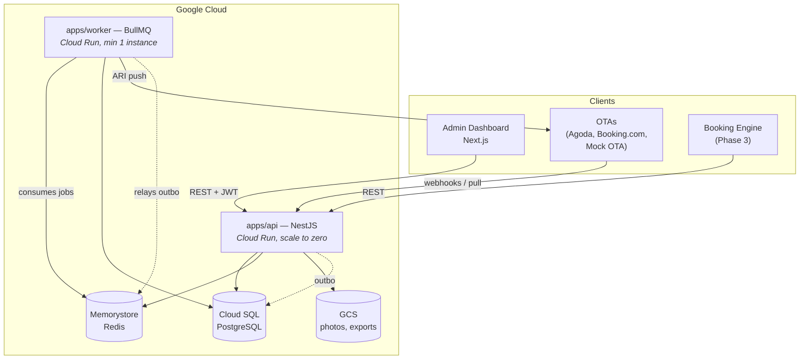
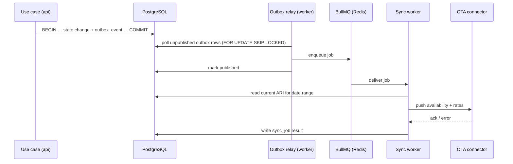

# DeeHub Hotel — High-Level Architecture

Engineering Task 4. How the system is structured, deployed, and kept honest.
Reads on top of [domain-model.md](domain-model.md).

---

## 1. Shape of the system

A **modular monolith**: one deployable API containing strictly separated
modules, plus a worker process and a web frontend. Not microservices.

Rationale: a 3-person team with AI as the primary developer cannot afford
distributed-systems overhead — network partitions between services,
cross-service transactions, per-service CI/CD, distributed tracing to debug a
booking. A booking that must atomically touch inventory and reservations is a
_local transaction_ here and would be a saga in microservices. Module
boundaries are enforced in code so that extracting a service later (most
likely the Sync Engine) is a refactor, not a rewrite.



| Process   | Entry point               | Responsibility                                                                     | Scaling                                            |
| --------- | ------------------------- | ---------------------------------------------------------------------------------- | -------------------------------------------------- |
| API       | `apps/api/dist/main.js`   | HTTP: admin dashboard, booking engine, OTA webhooks                                | Cloud Run, scale to zero, autoscale on requests    |
| Worker    | `apps/api/dist/worker.js` | BullMQ consumers: ARI push, reservation pull, outbox relay, expiry, reconciliation | Cloud Run with `min-instances=1` (must poll Redis) |
| Admin web | `apps/admin-web`          | Next.js dashboard                                                                  | Cloud Run (or static + SSR)                        |

Splitting the worker from the API is the one non-negotiable process
boundary: a burst of OTA sync work must never make the front desk slow, and
the two have opposite scaling profiles.

**Two entry points, one build.** The worker is `apps/api/src/worker.ts` with
its own root module (`WorkerModule`: no controllers, no HTTP guard, no request
middleware), not a separate `apps/worker` package. Deployment is unchanged —
two Cloud Run services from the same image, different commands, independent
scaling — but a separate package would have to import the API package, whose
entry point self-starts an HTTP server. Sharing the build avoids that
awkwardness and guarantees both processes run identical domain code.

---

## 2. Layering (Clean Architecture)

Four layers per module, dependencies pointing inward only:

```
interface/       controllers, DTOs, validation, presenters   ← HTTP knows about
     ↓
application/     use cases, orchestration, transactions      ← the only caller of domain
     ↓
domain/          entities, value objects, domain services,   ← knows nothing external
                 ports (interfaces), domain events
     ↑
infrastructure/  repositories, ORM entities, OTA clients,    ← implements domain ports
                 queue adapters, external SDKs
```

Hard rules:

- `domain/` imports nothing from NestJS, TypeORM/Prisma, HTTP, or Redis. It
  is plain TypeScript and unit-testable with no I/O.
- `application/` depends on domain **ports** (interfaces), never on
  `infrastructure/` classes. Wiring happens through NestJS DI at the module
  root.
- `interface/` never touches repositories directly.
- Persistence models are separate from domain entities where they diverge;
  mapping lives in `infrastructure/`.

This is the Repository + Adapter + Dependency Injection combination the
master prompt calls for, and it is what makes the OTA connector framework
possible: `ChannelConnector` is a domain port; Agoda, Booking.com and the
Mock OTA are interchangeable infrastructure adapters.

### Module folder shape (`apps/api/src/modules/reservations/`)

```
reservations/
├── domain/
│   ├── entities/          reservation.entity.ts, stay.entity.ts
│   ├── value-objects/     reservation-code.vo.ts, date-range.vo.ts
│   ├── events/            reservation-created.event.ts
│   ├── ports/             reservation.repository.ts (interface)
│   └── services/          reservation-pricing.service.ts
├── application/
│   ├── commands/          create-reservation.usecase.ts
│   ├── queries/           list-reservations.usecase.ts
│   └── dto/
├── infrastructure/
│   ├── persistence/       reservation.orm-entity.ts, typeorm-reservation.repository.ts
│   └── mappers/
├── interface/
│   ├── http/              reservations.controller.ts
│   └── dto/               create-reservation.request.ts
└── reservations.module.ts
```

### Enforcing module boundaries

Convention is not enough — boundaries are checked by CI:

1. Each module exposes a **public API** through `<module>.module.ts` and an
   `index.ts` barrel; deep imports (`../reservations/domain/entities/...`)
   from another module fail lint (`eslint-plugin-boundaries` / `import/no-restricted-paths`).
2. Cross-module calls go through an application service or a domain event —
   never a repository belonging to another module.
3. The dependency direction from the context map in
   [domain-model.md §2](domain-model.md) is a lint rule. Inventory must not
   import Reservations. A cycle fails the build.

---

## 3. Request lifecycle

```
HTTP request
  → Helmet / CORS / rate limiter
  → AuthGuard              verify JWT, load user
  → TenantContextGuard     resolve organizationId (+ propertyId) → AsyncLocalStorage
  → PermissionGuard        capability check ("reservation:cancel")
  → ValidationPipe         class-validator DTO, whitelist + forbid unknown
  → Controller             thin: maps DTO → use case input
  → Use case               opens transaction, calls domain, writes outbox
  → Interceptors           audit log, Sentry, structured logging, response shape
```

**Tenant context** lives in `AsyncLocalStorage` and is read by the repository
base class, which injects `organizationId` into every query. A repository
method that would run without a tenant context throws. This makes
cross-tenant leakage (the top risk of [ADR-0001](adr/0001-multi-property-saas.md))
a structural impossibility rather than a code-review responsibility. Postgres
Row-Level Security can be layered on later as defense in depth.

---

## 4. The booking transaction

The most important code path in the product. One database transaction:

```
BEGIN
  1. Load property, room type, rate plan   (tenant-scoped)
  2. Validate restrictions for every night: stop-sell, min/max stay, CTA/CTD
  3. Lock inventory rows FOR UPDATE, ORDER BY date        ← deterministic, deadlock-free
  4. Guarded UPDATE: booked = booked + units
        WHERE booked + units <= allotment
     Assert affected rows == number of nights, else ROLLBACK
  5. Price the stay → snapshot per-night Money
  6. INSERT reservation + stays + stay_nights
  7. INSERT audit_log
  8. INSERT outbox_event: reservation.created, inventory.changed
COMMIT
  → outbox relay → BullMQ → ARI push to every mapped channel
```

Steps 3–4 are the anti-overbooking guarantee
([ADR-0002](adr/0002-count-based-inventory.md)); step 8 is why the outbox
exists — inventory changes and their OTA notifications commit or fail
together.

---

## 5. Event flow and the outbox



Design notes:

- **`FOR UPDATE SKIP LOCKED`** lets multiple relay instances run without
  double-publishing.
- **At-least-once delivery.** Every consumer is idempotent; ARI pushes are
  naturally idempotent (they send absolute state, not deltas).
- **Debounce + coalesce.** Ten edits to the same room-type/date-range within
  the debounce window collapse into one push. Job key is
  `(channel, roomType, dateRange)`.
- **Retry:** exponential backoff, capped attempts, then dead-letter +
  `channel.sync_failed` alert. A silently stalled sync is the failure mode
  that causes overbookings, so it must page someone.

---

## 6. OTA connector framework

The master prompt's rule — _never hardcode OTA-specific logic into business
modules_ — is realized as a port/adapter pair:

```ts
// domain port — business modules depend only on this
interface ChannelConnector {
  readonly type: ChannelType;
  pushAri(ctx: ChannelContext, payload: AriPayload): Promise<PushResult>;
  fetchReservations(ctx: ChannelContext, since: Date): Promise<InboundReservation[]>;
  parseWebhook(raw: unknown, signature?: string): InboundReservation[];
  testConnection(ctx: ChannelContext): Promise<HealthResult>;
}
```

- Adapters live in `modules/channel/infrastructure/connectors/<ota>/` and are
  registered in a `ConnectorRegistry` keyed by `ChannelType`; the sync engine
  resolves connectors at runtime and knows no OTA names.
- Each adapter owns its own auth, payload mapping, quirks, rate limits, and
  error taxonomy. OTA-specific vocabulary never crosses into
  Inventory/Reservations.
- **Mock OTA** is a first-class adapter plus a small standalone service. It
  makes the framework testable end-to-end from day one, and stays forever as
  the integration-test harness — every future connector is validated against
  the same contract test suite the Mock OTA passes.

---

## 7. Data architecture

- **PostgreSQL** is the single source of truth. One database, one schema,
  every business table carrying `organization_id`.
- **Migrations** are versioned SQL/TypeORM migrations, forward-only, reviewed,
  and each has a documented rollback plan (Definition of Done). No
  auto-synchronize, ever.
- **Redis** serves BullMQ queues and short-lived caches (availability
  lookups, session/rate-limit counters). Redis is never a source of truth;
  losing it must cost throughput, never data.
- **GCS** holds room photos and exports; accessed through an S3-compatible
  client so MinIO works locally and the provider stays swappable.
- Detailed tables, indexes, and constraints: [database.md](database.md)
  (Task 5, next).

---

## 8. Frontend architecture

`apps/admin-web` — Next.js App Router + TypeScript + TailwindCSS.

- Server Components for data-heavy list/detail screens; Client Components for
  the interactive inventory calendar grid.
- API access through a generated typed SDK (`packages/sdk`) produced from the
  OpenAPI spec — no hand-written fetch calls, no client/server type drift.
- Server-side state: TanStack Query. Forms: react-hook-form + zod, sharing
  validation schemas with the API through `packages/shared`.
- Auth: JWT in httpOnly cookies, refresh handled in middleware; tokens never
  reach client-side JavaScript.
- `next-intl` from day one; English first, Thai as a locale file
  ([ADR-0003](adr/0003-thailand-first-i18n-ready.md)).
- Design priority is front-desk speed: keyboard-first, dense information,
  the inventory grid must stay responsive at 30 room types × 90 days.

---

## 9. Monorepo layout

```
apps/
  api/            NestJS — modules per bounded context
                  main.ts   → HTTP entry point
                  worker.ts → BullMQ entry point (same build, own root module)
  admin-web/      Next.js dashboard
  mock-ota/       Mock OTA service (Phase 2)
packages/
  shared/         Money, DateRange, event contracts, zod schemas, error types
  ui/             shared React components
  sdk/            generated typed API client
infrastructure/   Dockerfiles, docker-compose, Terraform, GitHub Actions
docs/             this documentation set
```

Tooling: **pnpm workspaces + Turborepo** (fast, cached, well-suited to
Next.js + NestJS in one repo). The worker is a second entry point inside
`apps/api` rather than its own package, so both processes share one build and
one copy of the domain code (see §1).

---

## 10. Cross-cutting concerns

| Concern         | Approach                                                                          |
| --------------- | --------------------------------------------------------------------------------- |
| **AuthN**       | JWT access (15 min) + refresh token (30 days, rotating, revocable, stored hashed) |
| **AuthZ**       | Capability-based guard; role → capability map; property-scoped roles              |
| **Tenancy**     | `AsyncLocalStorage` context + repository-level scoping; unscoped query throws     |
| **Validation**  | zod/class-validator at the edge; domain re-validates its own invariants           |
| **Errors**      | Typed domain errors → HTTP status mapping in one filter; never leak internals     |
| **Audit**       | Interceptor + explicit domain writes; append-only; actor, before/after, IP        |
| **Logging**     | Structured JSON (pino) with request ID, org ID, property ID → Cloud Logging       |
| **Monitoring**  | Sentry for errors; metrics on sync latency, queue depth, booking failures         |
| **Secrets**     | Secret Manager; OTA credentials encrypted at rest with envelope encryption        |
| **Config**      | Typed, validated at boot; the app refuses to start on invalid config              |
| **Rate limits** | Per-IP and per-org on the API; per-channel outbound limits in connectors          |

---

## 11. Known risks

| Risk                                               | Impact                                | Mitigation                                                                                                   |
| -------------------------------------------------- | ------------------------------------- | ------------------------------------------------------------------------------------------------------------ |
| **Overbooking via race condition**                 | Severe — reputational and financial   | Atomic guarded UPDATE + DB CHECK constraint + deterministic lock order + nightly reconciliation (§4)         |
| **Sync stalls silently**                           | Severe — OTAs sell stale availability | Dead-letter queue, `channel.sync_failed` alerts, per-channel health checks, sync-latency dashboards          |
| **Cross-tenant data leak**                         | Severe — trust-ending                 | Repository-level tenant scoping, isolation test per feature, later Postgres RLS                              |
| **OTA API changes / certification delays**         | Schedule risk                         | Connectors isolated behind a port; contract tests; Mock OTA proves the framework independent of any real OTA |
| **Modular monolith erodes into a big ball of mud** | Slows everything                      | Lint-enforced boundaries, dependency-direction rules in CI (§2)                                              |
| **Redis loss**                                     | Sync backlog                          | Outbox is in Postgres — unpublished events survive and replay; Redis rebuild is throughput-only              |
| **Single-region Cloud SQL outage**                 | Downtime                              | Accepted for Milestone 1; PITR backups; HA tier when revenue justifies it                                    |
| **AI-generated code volume outpaces review**       | Latent defects                        | Definition of Done, small commits, tests required, high-risk paths (inventory, money, auth) get human review |

---

## 12. Deliberate non-choices

- **No microservices.** Revisit only when a module's scaling or team
  ownership genuinely diverges — the Sync Engine is the first candidate, and
  the port/adapter boundary already makes it extractable.
- **No GraphQL.** REST + OpenAPI + a generated SDK is simpler for one
  first-party client and easier for OTA-facing integration work.
- **No event sourcing.** Event-driven, yes; event-sourced, no. Audit logs and
  the outbox cover traceability without the complexity cost.
- **No CQRS read models** in v1. Postgres indexes and views are sufficient
  until analytics volume proves otherwise.
- **No Kubernetes.** Cloud Run covers it with a fraction of the ops burden.
