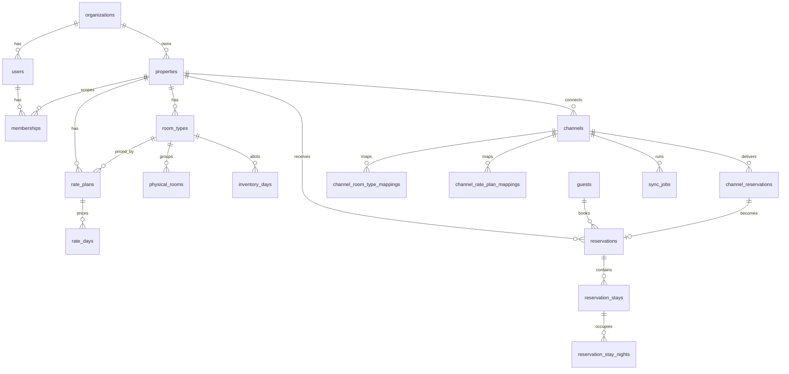

# DeeHub Hotel — Database Design

Engineering Task 5. PostgreSQL schema for Milestone 1 (Phases 0–2:
identity, property setup, inventory, rates, reservations, channels,
platform). Implements [domain-model.md](domain-model.md); constrained by
[ADR-0001](adr/0001-multi-property-saas.md),
[ADR-0002](adr/0002-count-based-inventory.md),
[ADR-0003](adr/0003-thailand-first-i18n-ready.md).

The DDL below is the reference; the executable source of truth is the
versioned migrations in `apps/api/src/database/migrations/`.

---

## 1. Conventions

| Rule         | Choice                                                   | Why                                                                                                                                                |
| ------------ | -------------------------------------------------------- | -------------------------------------------------------------------------------------------------------------------------------------------------- |
| Names        | `snake_case`, tables plural                              | Postgres convention                                                                                                                                |
| Primary keys | `uuid` **v7**, generated in the application              | Time-ordered, so index locality is close to a bigserial without leaking counts or being guessable. `gen_random_uuid()` only as a DB-side fallback. |
| Tenancy      | every business table has `organization_id uuid NOT NULL` | ADR-0001; repository layer always filters on it                                                                                                    |
| Instants     | `timestamptz`, stored UTC                                | audit, sync, created/updated                                                                                                                       |
| Nights       | `date`                                                   | ADR-0003 — a hotel night is a calendar date in the property's timezone, never a timestamp                                                          |
| Money        | `amount_minor bigint` + `currency char(3)`               | ADR-0003; no floats. `bigint` because THB satang overflows `int4` at ~21M THB                                                                      |
| Percentages  | integer **basis points** (`700` = 7.00%)                 | exact arithmetic for VAT and service charge                                                                                                        |
| Enums        | `text` + `CHECK (col IN (...))`                          | Postgres `ENUM` types cannot drop values and complicate migrations. A CHECK is one migration to change.                                            |
| Deletes      | soft (`is_active`, `status`) for configuration entities  | reservations reference room types forever; hard deletes would corrupt history                                                                      |
| Timestamps   | `created_at`, `updated_at` on every table                | `updated_at` maintained by trigger                                                                                                                 |

Required extension: `pgcrypto` (for `gen_random_uuid()`).

**One stay = one room unit.** A guest booking two Deluxe rooms produces two
`reservation_stays`. This keeps room assignment, per-room occupancy, and
inventory counting simple: units held on a night = number of stay-nights.

**Creation order.** The DDL below is grouped by bounded context for reading,
not in dependency order — `memberships` references `properties`, and
`reservations` references `channels`, both defined in later sections.
Migrations create tables in dependency order (organizations → properties →
room types → rate plans → channels → memberships → reservations → …).

---

## 2. Entity relationships



---

## 3. Identity & Access

```sql
CREATE TABLE organizations (
  id           uuid PRIMARY KEY,
  name         text NOT NULL,
  slug         text NOT NULL,
  status       text NOT NULL DEFAULT 'ACTIVE'
               CHECK (status IN ('ACTIVE','SUSPENDED','CANCELLED')),
  plan         text NOT NULL DEFAULT 'TRIAL',
  created_at   timestamptz NOT NULL DEFAULT now(),
  updated_at   timestamptz NOT NULL DEFAULT now()
);
CREATE UNIQUE INDEX organizations_slug_uq ON organizations (lower(slug));

CREATE TABLE users (
  id              uuid PRIMARY KEY,
  organization_id uuid NOT NULL REFERENCES organizations(id) ON DELETE RESTRICT,
  email           text NOT NULL,
  password_hash   text NOT NULL,              -- argon2id
  full_name       text NOT NULL,
  status          text NOT NULL DEFAULT 'ACTIVE'
                  CHECK (status IN ('ACTIVE','INVITED','DISABLED')),
  -- The dashboard language this person chose, applied at sign-in on any
  -- machine. NULL: never chose; the browser's own choice or English stands.
  preferred_locale text CHECK (preferred_locale IS NULL OR preferred_locale IN ('en','th')),
  last_login_at   timestamptz,
  created_at      timestamptz NOT NULL DEFAULT now(),
  updated_at      timestamptz NOT NULL DEFAULT now()
);
-- Email is unique per tenant, not globally: the same person may work for two orgs.
CREATE UNIQUE INDEX users_org_email_uq ON users (organization_id, lower(email));

-- Role assignment. property_id NULL = organization-wide scope.
CREATE TABLE memberships (
  id              uuid PRIMARY KEY,
  organization_id uuid NOT NULL REFERENCES organizations(id) ON DELETE CASCADE,
  user_id         uuid NOT NULL REFERENCES users(id) ON DELETE CASCADE,
  property_id     uuid REFERENCES properties(id) ON DELETE CASCADE,
  role            text NOT NULL
                  CHECK (role IN ('OWNER','ADMIN','MANAGER','FRONT_DESK','READ_ONLY')),
  created_at      timestamptz NOT NULL DEFAULT now(),
  updated_at      timestamptz NOT NULL DEFAULT now()
);
-- NULLs are distinct in a normal unique index, so org-wide rows need their own guard.
CREATE UNIQUE INDEX memberships_user_property_uq
  ON memberships (user_id, property_id) WHERE property_id IS NOT NULL;
CREATE UNIQUE INDEX memberships_user_org_wide_uq
  ON memberships (user_id) WHERE property_id IS NULL;

CREATE TABLE refresh_tokens (
  id              uuid PRIMARY KEY,
  organization_id uuid NOT NULL REFERENCES organizations(id) ON DELETE CASCADE,
  user_id         uuid NOT NULL REFERENCES users(id) ON DELETE CASCADE,
  token_hash      text NOT NULL,              -- sha256; raw token never stored
  expires_at      timestamptz NOT NULL,
  revoked_at      timestamptz,
  replaced_by_id  uuid REFERENCES refresh_tokens(id),
  user_agent      text,
  ip              inet,
  created_at      timestamptz NOT NULL DEFAULT now()
);
CREATE UNIQUE INDEX refresh_tokens_hash_uq ON refresh_tokens (token_hash);
CREATE INDEX refresh_tokens_user_active_idx
  ON refresh_tokens (user_id) WHERE revoked_at IS NULL;

CREATE TABLE password_reset_tokens (
  id              uuid PRIMARY KEY,
  organization_id uuid NOT NULL REFERENCES organizations(id) ON DELETE CASCADE,
  user_id         uuid NOT NULL REFERENCES users(id) ON DELETE CASCADE,
  token_hash      text NOT NULL,              -- sha256; the raw token exists only in the email
  expires_at      timestamptz NOT NULL,
  consumed_at     timestamptz,                -- somebody clicked this one
  invalidated_at  timestamptz,                -- a later event made it moot
  requested_ip    inet,
  created_at      timestamptz NOT NULL DEFAULT now()
);
CREATE UNIQUE INDEX password_reset_tokens_hash_uq
  ON password_reset_tokens (token_hash);
CREATE INDEX password_reset_tokens_user_live_idx
  ON password_reset_tokens (user_id, created_at DESC)
  WHERE consumed_at IS NULL AND invalidated_at IS NULL;
```

Rotating refresh tokens with `replaced_by_id` gives reuse detection: if a
revoked token is presented, the whole chain is compromised and every token
for that user is revoked.

`password_reset_tokens` separates **consumed** from **invalidated** because the
two are different events and an incident needs to tell them apart: consumed
means a person opened that link, invalidated means something else — a
successful reset through a different link, a password change, an operator reset
— retired it while nobody was looking. Rows survive being spent rather than
being deleted, so "already used" and "never existed" stay distinguishable; the
maintenance job forgets them after thirty days.

The partial index is what the per-account throttle reads: at most three live
links per fifteen minutes, so the endpoint cannot be used to flood a mailbox
from the hotel's own verified sender.

---

## 4. Property setup

```sql
CREATE TABLE properties (
  id                    uuid PRIMARY KEY,
  organization_id       uuid NOT NULL REFERENCES organizations(id) ON DELETE RESTRICT,
  code                  text NOT NULL,
  name                  text NOT NULL,
  timezone              text NOT NULL DEFAULT 'Asia/Bangkok',   -- IANA
  currency              char(3) NOT NULL DEFAULT 'THB',         -- ISO 4217
  country               char(2) NOT NULL DEFAULT 'TH',
  address_line1         text, address_line2 text, city text,
  postal_code           text, phone text, email text,
  -- What a guest and Google see (0016). Nullable: a property sells through
  -- the desk long before anyone writes its blurb.
  website               text,
  latitude              numeric(9,6) CHECK (latitude  IS NULL OR latitude  BETWEEN -90  AND 90),
  longitude             numeric(9,6) CHECK (longitude IS NULL OR longitude BETWEEN -180 AND 180),
  description_th        text, description_en text,
  amenities             jsonb NOT NULL DEFAULT '[]',          -- ["Free Wi-Fi","Parking"]
  check_in_time         time NOT NULL DEFAULT '14:00',
  check_out_time        time NOT NULL DEFAULT '12:00',
  tax_rate_bp           integer NOT NULL DEFAULT 700   CHECK (tax_rate_bp BETWEEN 0 AND 10000),
  service_charge_rate_bp integer NOT NULL DEFAULT 1000 CHECK (service_charge_rate_bp BETWEEN 0 AND 10000),
  prices_include_tax    boolean NOT NULL DEFAULT false,
  status                text NOT NULL DEFAULT 'ACTIVE'
                        CHECK (status IN ('ACTIVE','INACTIVE')),
  created_at            timestamptz NOT NULL DEFAULT now(),
  updated_at            timestamptz NOT NULL DEFAULT now()
);
CREATE UNIQUE INDEX properties_org_code_uq ON properties (organization_id, lower(code));

CREATE TABLE room_types (
  id                  uuid PRIMARY KEY,
  organization_id     uuid NOT NULL REFERENCES organizations(id) ON DELETE RESTRICT,
  property_id         uuid NOT NULL REFERENCES properties(id) ON DELETE RESTRICT,
  code                text NOT NULL,
  name                text NOT NULL,
  description         text,                 -- English
  description_th      text,
  bed_config          text,                 -- "1 king bed"; printed under the name online
  size_sqm            smallint CHECK (size_sqm IS NULL OR size_sqm > 0),
  standard_occupancy  smallint NOT NULL DEFAULT 2 CHECK (standard_occupancy >= 1),
  max_occupancy       smallint NOT NULL DEFAULT 2 CHECK (max_occupancy >= 1),
  max_adults          smallint NOT NULL DEFAULT 2 CHECK (max_adults >= 1),
  max_children        smallint NOT NULL DEFAULT 0 CHECK (max_children >= 0),
  sort_order          integer NOT NULL DEFAULT 0,
  is_active           boolean NOT NULL DEFAULT true,
  created_at          timestamptz NOT NULL DEFAULT now(),
  updated_at          timestamptz NOT NULL DEFAULT now(),
  CONSTRAINT room_types_occupancy_ck CHECK (standard_occupancy <= max_occupancy)
);
CREATE UNIQUE INDEX room_types_property_code_uq ON room_types (property_id, lower(code));

CREATE TABLE physical_rooms (
  id                  uuid PRIMARY KEY,
  organization_id     uuid NOT NULL REFERENCES organizations(id) ON DELETE RESTRICT,
  property_id         uuid NOT NULL REFERENCES properties(id) ON DELETE RESTRICT,
  room_type_id        uuid NOT NULL REFERENCES room_types(id) ON DELETE RESTRICT,
  room_number         text NOT NULL,
  floor               text,
  housekeeping_status text NOT NULL DEFAULT 'CLEAN'
                      CHECK (housekeeping_status IN ('CLEAN','DIRTY','INSPECTED','OUT_OF_ORDER')),
  notes               text,
  is_active           boolean NOT NULL DEFAULT true,
  created_at          timestamptz NOT NULL DEFAULT now(),
  updated_at          timestamptz NOT NULL DEFAULT now()
);
CREATE UNIQUE INDEX physical_rooms_property_number_uq ON physical_rooms (property_id, lower(room_number));

CREATE TABLE rate_plans (
  id                  uuid PRIMARY KEY,
  organization_id     uuid NOT NULL REFERENCES organizations(id) ON DELETE RESTRICT,
  property_id         uuid NOT NULL REFERENCES properties(id) ON DELETE RESTRICT,
  room_type_id        uuid NOT NULL REFERENCES room_types(id) ON DELETE RESTRICT,
  code                text NOT NULL,
  name                text NOT NULL,
  parent_rate_plan_id uuid REFERENCES rate_plans(id) ON DELETE RESTRICT,
  derivation_type     text CHECK (derivation_type IN ('PERCENTAGE','AMOUNT')),
  derivation_value    integer,                    -- bp if PERCENTAGE, minor units if AMOUNT
  meal_plan           text NOT NULL DEFAULT 'ROOM_ONLY'
                      CHECK (meal_plan IN ('ROOM_ONLY','BREAKFAST','HALF_BOARD','FULL_BOARD','ALL_INCLUSIVE')),
  cancellation_policy jsonb NOT NULL DEFAULT '{}'::jsonb,
  is_refundable       boolean NOT NULL DEFAULT true,
  -- Off = desk only: the booking engine and the metasearch feed skip it, so a
  -- corporate or walk-in rate never becomes the lowest price a stranger sees.
  sell_online         boolean NOT NULL DEFAULT true,
  is_active           boolean NOT NULL DEFAULT true,
  created_at          timestamptz NOT NULL DEFAULT now(),
  updated_at          timestamptz NOT NULL DEFAULT now(),
  -- derived plans need both derivation fields; base plans need neither
  CONSTRAINT rate_plans_derivation_ck CHECK (
    (parent_rate_plan_id IS NULL AND derivation_type IS NULL AND derivation_value IS NULL)
    OR (parent_rate_plan_id IS NOT NULL AND derivation_type IS NOT NULL AND derivation_value IS NOT NULL)
  ),
  CONSTRAINT rate_plans_no_self_parent_ck CHECK (parent_rate_plan_id <> id)
);
CREATE UNIQUE INDEX rate_plans_property_code_uq ON rate_plans (property_id, lower(code));
```

One-level-only derivation (a parent may not itself be derived) is a
cross-row rule; it is enforced in the domain and by a trigger, since a CHECK
cannot see other rows.

---

## 5. Inventory — the critical table

```sql
CREATE TABLE inventory_days (
  organization_id     uuid NOT NULL REFERENCES organizations(id) ON DELETE RESTRICT,
  property_id         uuid NOT NULL REFERENCES properties(id) ON DELETE RESTRICT,
  room_type_id        uuid NOT NULL REFERENCES room_types(id) ON DELETE RESTRICT,
  date                date NOT NULL,
  allotment           integer NOT NULL DEFAULT 0,
  booked              integer NOT NULL DEFAULT 0,
  stop_sell           boolean NOT NULL DEFAULT false,
  min_stay            smallint NOT NULL DEFAULT 1 CHECK (min_stay >= 1),
  max_stay            smallint CHECK (max_stay IS NULL OR max_stay >= min_stay),
  closed_to_arrival   boolean NOT NULL DEFAULT false,
  closed_to_departure boolean NOT NULL DEFAULT false,
  updated_at          timestamptz NOT NULL DEFAULT now(),

  PRIMARY KEY (room_type_id, date),

  -- THE anti-overbooking guarantee. Holds even if application code is wrong.
  CONSTRAINT inventory_allotment_nonneg_ck CHECK (allotment >= 0),
  CONSTRAINT inventory_booked_range_ck     CHECK (booked >= 0 AND booked <= allotment)
);

-- Sync engine: "what changed for this property since the last push?"
CREATE INDEX inventory_days_property_updated_idx ON inventory_days (property_id, updated_at);
-- Availability search across room types for a date range.
CREATE INDEX inventory_days_property_date_idx ON inventory_days (property_id, date);
```

**Composite primary key, no surrogate id.** `(room_type_id, date)` is the
natural key, nothing references an inventory row by ID, and every access
path is by room type and date. This gives one index instead of two and puts
the rows a booking needs physically adjacent. Deliberate exception to the
UUID-PK convention; `rate_days` follows the same reasoning.

**A missing row means zero allotment**, not "unlimited" — a date the hotel
has not opened cannot be sold (domain-model §3.3). Rows are created by an
"open dates" action and by a rolling job that extends the horizon (default
730 days).

---

## 6. Rates

```sql
CREATE TABLE rate_days (
  organization_id  uuid NOT NULL REFERENCES organizations(id) ON DELETE RESTRICT,
  property_id      uuid NOT NULL REFERENCES properties(id) ON DELETE RESTRICT,
  rate_plan_id     uuid NOT NULL REFERENCES rate_plans(id) ON DELETE CASCADE,
  date             date NOT NULL,
  occupancy        smallint NOT NULL CHECK (occupancy >= 1),
  amount_minor     bigint NOT NULL CHECK (amount_minor >= 0),
  currency         char(3) NOT NULL,
  updated_at       timestamptz NOT NULL DEFAULT now(),
  PRIMARY KEY (rate_plan_id, date, occupancy)
);
CREATE INDEX rate_days_property_updated_idx ON rate_days (property_id, updated_at);
CREATE INDEX rate_days_property_date_idx ON rate_days (property_id, date);
```

Occupancy-based pricing (single/double/triple) is standard for Thai hotels
and required by every OTA. Derived rate plans have no rows here — their
price is computed from the parent at read time and snapshotted on booking.

```sql
CREATE VIEW effective_rate_days AS
  -- Base plans: their own stored rows.
  SELECT ... FROM rate_days rd JOIN rate_plans rp ON rp.id = rd.rate_plan_id
   WHERE rp.parent_rate_plan_id IS NULL
  UNION ALL
  -- Derived plans: the parent's rows, offset.
  SELECT ..., CASE child.derivation_type
                WHEN 'PERCENTAGE'
                  THEN round(rd.amount_minor::numeric * (10000 + child.derivation_value) / 10000)
                ELSE rd.amount_minor + child.derivation_value
              END::bigint, ...
    FROM rate_plans child
    JOIN rate_plans parent ON parent.id = child.parent_rate_plan_id
    JOIN rate_days rd ON rd.rate_plan_id = parent.id
   WHERE parent.parent_rate_plan_id IS NULL   -- one level, no chains
     AND <computed> > 0;                      -- absent, never free
```

**Every rate READ goes through the view; writes still go to `rate_days`.** The
booking path, the ARI push and the grid's lead rate all need a derived plan's
price, and three implementations of the same arithmetic is three chances to
quote a different number than the guest was shown.

`numeric`, not float, and `round()` away from zero to match `roundHalfUp` in
`pricing.ts` — the two must agree or a quoted total and a folio line differ by a
satang.

Two rules are in the SQL rather than only in the application. **One level**: a
plan whose parent is itself derived resolves to nothing, so a chain that ever
got past validation is unsellable rather than compounding. **Zero is absent**:
a computed price of zero or less is omitted entirely, because a zero-priced
night sells the room for nothing — the same rule the rate editor follows by
removing prices instead of zeroing them.

---

## 7. Guests

```sql
CREATE TABLE guests (
  id               uuid PRIMARY KEY,
  organization_id  uuid NOT NULL REFERENCES organizations(id) ON DELETE RESTRICT,
  first_name       text NOT NULL,
  last_name        text,
  email            text,
  phone            text,
  nationality      char(2),
  document_type    text CHECK (document_type IN ('PASSPORT','NATIONAL_ID','DRIVING_LICENSE')),
  document_number_encrypted bytea,        -- envelope-encrypted (KMS), never plaintext
  date_of_birth    date,
  preferences      jsonb NOT NULL DEFAULT '{}'::jsonb,
  notes            text,
  merged_into_id   uuid REFERENCES guests(id) ON DELETE RESTRICT,   -- tombstone
  merged_at        timestamptz,
  created_at       timestamptz NOT NULL DEFAULT now(),
  updated_at       timestamptz NOT NULL DEFAULT now(),
  CONSTRAINT guests_merged_ck CHECK (
    (merged_into_id IS NULL) = (merged_at IS NULL)
    AND merged_into_id IS DISTINCT FROM id
  )
);
-- Guests are shared across an organization's properties. Not unique on email:
-- OTAs supply masked/aliased addresses, so duplicates are expected and merged.
CREATE INDEX guests_org_email_idx ON guests (organization_id, lower(email));
CREATE INDEX guests_org_phone_idx ON guests (organization_id, phone);
CREATE INDEX guests_org_name_idx  ON guests (organization_id, lower(last_name), lower(first_name));
```

A merged profile is **tombstoned, not deleted**. Its reservations have all moved
to the survivor so nothing depends on it, and dropping the row would work — but a
merge cannot be reconstructed from the surviving data, and an id that still
resolves is what makes "who was this?" answerable afterwards. Every read path
filters `merged_into_id IS NOT NULL` out: search, fetch by id, the duplicate
candidate list, and the booking path's `findMatch`, which must never attach a new
stay to a record nothing reads.

The `guests_merged_ck` constraint keeps the pair honest and forbids a
self-reference. It does not forbid a CHAIN — A merged into B, later B into C —
because the application refuses that case with a message an operator can act on,
and a check constraint cannot see another row anyway. The refusal matters:
allowing it would leave A's stays behind a tombstone whose own survivor has
moved on.

The duplicate search compares the **last nine digits** of a phone number, so
`081 234 5678` and `+66 81 234 5678` are one number. `guests_org_phone_idx`
does not serve that comparison — the predicate is not sargable against it — and
deliberately has no expression index of its own: the scan is bounded by one
organization's guest book and runs when somebody opens a panel, not on every
page load. If a group's guest count ever makes that hurt, the fix is an index on
`right(regexp_replace(phone, '\D', '', 'g'), 9)`, not a different rule.

---

## 8a. Booking sources

Where a booking came through — Agoda, Booking.com, a travel agent the hotel
has a contract with — as a list each property keeps (ADR-0009). Not a channel:
a `channels` row is a connector with credentials and a sync queue; this is a
label the front desk picks when it keys in a booking that arrived by extranet
or by phone from an agent, and the thing reports group revenue by.

```sql
CREATE TABLE booking_sources (
  id                uuid PRIMARY KEY,
  organization_id   uuid NOT NULL REFERENCES organizations(id) ON DELETE RESTRICT,
  property_id       uuid NOT NULL REFERENCES properties(id) ON DELETE RESTRICT,
  name              text NOT NULL,
  kind              text NOT NULL CHECK (kind IN ('OTA','TRAVEL_AGENT')),
  -- Ties the label to a connector type, so a connector's bookings land under
  -- the same label the desk used by hand. NULL for agents and for OTAs we
  -- have no connector type for yet.
  channel_type      text CHECK (channel_type IS NULL OR channel_type IN
                      ('MOCK_OTA','AGODA','BOOKING_COM','EXPEDIA','TRIP_COM','AIRBNB','DIRECT')),
  is_active         boolean NOT NULL DEFAULT true,
  created_at        timestamptz NOT NULL DEFAULT now(),
  updated_at        timestamptz NOT NULL DEFAULT now()
);
CREATE UNIQUE INDEX booking_sources_property_name_uq
  ON booking_sources (property_id, lower(name));
CREATE UNIQUE INDEX booking_sources_property_channel_type_uq
  ON booking_sources (property_id, channel_type) WHERE channel_type IS NOT NULL;
```

No delete: reservations reference these, and "how much did Agoda bring in
last year" must keep working after the hotel stops selling there. `is_active`
takes one off the form. The kind never changes either — every booking that
named the source recorded its category from it. Every property starts with
the usual OTAs (migration 0013 backfills, the seed and `POST
booking-sources/defaults` cover the rest).

---

## 8b. Media (photos)

Photos of a property and of its room types, for the booking page. The bytes
live in an S3-compatible object store (MinIO locally, Google Cloud Storage
through its S3 interoperability endpoint in production, ADR-0004); the row is
what points at them.

```sql
CREATE TABLE media (
  id               uuid PRIMARY KEY,
  organization_id  uuid NOT NULL REFERENCES organizations(id) ON DELETE RESTRICT,
  property_id      uuid NOT NULL REFERENCES properties(id) ON DELETE RESTRICT,
  kind             text NOT NULL CHECK (kind IN ('PROPERTY','ROOM_TYPE')),
  room_type_id     uuid REFERENCES room_types(id) ON DELETE RESTRICT,
  object_key       text NOT NULL,          -- "public/{org}/{property}/{id}.jpg"; never a URL
  content_type     text NOT NULL,
  bytes            integer NOT NULL CHECK (bytes > 0),
  width            integer, height integer,
  alt              text,
  sort_order       integer NOT NULL DEFAULT 0,   -- 0 is the cover
  created_at       timestamptz NOT NULL DEFAULT now(),
  CONSTRAINT media_room_type_ck CHECK (
    (kind = 'ROOM_TYPE' AND room_type_id IS NOT NULL) OR (kind = 'PROPERTY' AND room_type_id IS NULL))
);
CREATE UNIQUE INDEX media_object_key_uq   ON media (object_key);
CREATE INDEX        media_property_kind_idx ON media (property_id, kind, room_type_id, sort_order);
```

Rules:

- **The key is minted by the server**, never accepted from a client: it is the
  tenant boundary inside the bucket, and a client naming a key could hang
  another tenant's object on its own page. The public host is prepended on the
  way out, so moving to a CDN is a config change.
- **Two steps, browser-driven.** The API signs a PUT for exactly one key, type
  and size (`POST /media/uploads`) and writes nothing; the browser PUTs the
  file to the store; only then is the row written (`POST /media`), and only
  after the API has HEADed the object. A row that points at nothing is a broken
  image on the booking page for every guest.
- **Delete removes the row, then the object.** In that order: a row without an
  object is a broken picture, an object without a row is a few hundred
  kilobytes nobody can see. A failed second step is logged, not surfaced.
- At most 20 photos per gallery, 5 MB each, JPEG/PNG/WebP. The dashboard
  shrinks phone photos to 1600 px before upload; the server enforces the cap
  regardless.

## 8. Reservations

```sql
CREATE TABLE reservations (
  id                    uuid PRIMARY KEY,
  organization_id       uuid NOT NULL REFERENCES organizations(id) ON DELETE RESTRICT,
  property_id           uuid NOT NULL REFERENCES properties(id) ON DELETE RESTRICT,
  code                  text NOT NULL,                    -- human reference, e.g. DH-8F3K2A
  status                text NOT NULL
                        CHECK (status IN ('PENDING','CONFIRMED','CHECKED_IN','CHECKED_OUT',
                                          'CANCELLED','NO_SHOW','EXPIRED')),
  channel_id            uuid REFERENCES channels(id) ON DELETE RESTRICT,
  -- The category. OTA and TRAVEL_AGENT bookings also say WHICH one (§8a).
  source                text NOT NULL DEFAULT 'DIRECT'
                        CHECK (source IN ('DIRECT','OTA','WALK_IN','PHONE','EMAIL','TRAVEL_AGENT')),
  booking_source_id     uuid REFERENCES booking_sources(id) ON DELETE RESTRICT,
  guest_id              uuid REFERENCES guests(id) ON DELETE SET NULL,
  -- Contact as received. Kept raw because OTA-masked addresses must survive verbatim.
  booker_name           text NOT NULL,
  booker_email          text,
  booker_phone          text,
  currency              char(3) NOT NULL,
  subtotal_minor        bigint NOT NULL DEFAULT 0 CHECK (subtotal_minor >= 0),
  tax_minor             bigint NOT NULL DEFAULT 0 CHECK (tax_minor >= 0),
  service_charge_minor  bigint NOT NULL DEFAULT 0 CHECK (service_charge_minor >= 0),
  total_minor           bigint NOT NULL DEFAULT 0 CHECK (total_minor >= 0),
  hold_expires_at       timestamptz,                      -- PENDING only
  cancelled_at          timestamptz,
  cancellation_reason   text,
  special_requests      text,
  version               integer NOT NULL DEFAULT 0,       -- optimistic locking
  created_at            timestamptz NOT NULL DEFAULT now(),
  updated_at            timestamptz NOT NULL DEFAULT now(),
  CONSTRAINT reservations_hold_ck CHECK (status <> 'PENDING' OR hold_expires_at IS NOT NULL)
);
CREATE UNIQUE INDEX reservations_property_code_uq ON reservations (property_id, upper(code));
CREATE INDEX reservations_property_status_idx  ON reservations (property_id, status);
CREATE INDEX reservations_property_created_idx ON reservations (property_id, created_at DESC);
CREATE INDEX reservations_guest_idx            ON reservations (guest_id) WHERE guest_id IS NOT NULL;
-- Hold-expiry sweeper reads only this tiny slice.
CREATE INDEX reservations_pending_expiry_idx
  ON reservations (hold_expires_at) WHERE status = 'PENDING';

CREATE TABLE reservation_stays (
  id                  uuid PRIMARY KEY,
  organization_id     uuid NOT NULL REFERENCES organizations(id) ON DELETE RESTRICT,
  property_id         uuid NOT NULL REFERENCES properties(id) ON DELETE RESTRICT,
  reservation_id      uuid NOT NULL REFERENCES reservations(id) ON DELETE CASCADE,
  room_type_id        uuid NOT NULL REFERENCES room_types(id) ON DELETE RESTRICT,
  rate_plan_id        uuid NOT NULL REFERENCES rate_plans(id) ON DELETE RESTRICT,
  check_in            date NOT NULL,
  check_out           date NOT NULL,
  adults              smallint NOT NULL DEFAULT 1 CHECK (adults >= 1),
  children            smallint NOT NULL DEFAULT 0 CHECK (children >= 0),
  assigned_room_id    uuid REFERENCES physical_rooms(id) ON DELETE SET NULL,  -- Phase 4
  guest_name          text,
  -- Where the frozen night prices came from, and why a typed price sits below
  -- the plan. Reports keep a discount apart from an OTA price and list price.
  priced_from         text NOT NULL DEFAULT 'PROPERTY_RATES'
                      CHECK (priced_from IN ('PROPERTY_RATES','CHANNEL','MANUAL')),
  price_note          text,
  subtotal_minor      bigint NOT NULL DEFAULT 0 CHECK (subtotal_minor >= 0),
  created_at          timestamptz NOT NULL DEFAULT now(),
  updated_at          timestamptz NOT NULL DEFAULT now(),
  CONSTRAINT stays_date_order_ck CHECK (check_out > check_in)
);
CREATE INDEX reservation_stays_reservation_idx ON reservation_stays (reservation_id);
CREATE INDEX reservation_stays_arrivals_idx    ON reservation_stays (property_id, check_in);
CREATE INDEX reservation_stays_departures_idx  ON reservation_stays (property_id, check_out);

CREATE TABLE reservation_stay_nights (
  stay_id          uuid NOT NULL REFERENCES reservation_stays(id) ON DELETE CASCADE,
  date             date NOT NULL,
  organization_id  uuid NOT NULL REFERENCES organizations(id) ON DELETE RESTRICT,
  reservation_id   uuid NOT NULL REFERENCES reservations(id) ON DELETE CASCADE,
  -- Denormalized so reconciliation and occupancy reports never join upward.
  property_id      uuid NOT NULL REFERENCES properties(id) ON DELETE RESTRICT,
  room_type_id     uuid NOT NULL REFERENCES room_types(id) ON DELETE RESTRICT,
  amount_minor     bigint NOT NULL CHECK (amount_minor >= 0),   -- PRICE SNAPSHOT
  currency         char(3) NOT NULL,
  PRIMARY KEY (stay_id, date)
);
CREATE INDEX rsn_property_roomtype_date_idx ON reservation_stay_nights (property_id, room_type_id, date);
CREATE INDEX rsn_reservation_idx            ON reservation_stay_nights (reservation_id);
```

`amount_minor` on a stay-night is a **snapshot**, never recomputed. Editing a
rate plan must never change what a past guest was quoted (domain-model §3.5).

---

### 8.1 Folio

```sql
CREATE TABLE folio_charges (
  id               uuid PRIMARY KEY,
  organization_id  uuid NOT NULL REFERENCES organizations(id) ON DELETE RESTRICT,
  property_id      uuid NOT NULL REFERENCES properties(id) ON DELETE RESTRICT,
  reservation_id   uuid NOT NULL REFERENCES reservations(id) ON DELETE RESTRICT,
  kind             text NOT NULL,          -- MINIBAR, LAUNDRY, DAMAGE, …
  description      text,
  amount_minor     bigint NOT NULL CHECK (amount_minor > 0),
  currency         char(3) NOT NULL,
  taxable          boolean NOT NULL DEFAULT true,
  business_date    date NOT NULL,          -- property timezone, not UTC
  posted_by_user_id uuid REFERENCES users(id) ON DELETE SET NULL,
  posted_at        timestamptz NOT NULL DEFAULT now(),
  voided_at        timestamptz,
  voided_reason    text,
  voided_by_user_id uuid REFERENCES users(id) ON DELETE SET NULL,
  CONSTRAINT folio_charges_void_ck CHECK ((voided_at IS NULL) = (voided_reason IS NULL))
);
CREATE INDEX folio_charges_reservation_idx    ON folio_charges (reservation_id, posted_at);
CREATE INDEX folio_charges_business_date_idx  ON folio_charges (property_id, business_date);

CREATE TABLE folio_payments (
  id               uuid PRIMARY KEY,
  organization_id  uuid NOT NULL REFERENCES organizations(id) ON DELETE RESTRICT,
  property_id      uuid NOT NULL REFERENCES properties(id) ON DELETE RESTRICT,
  reservation_id   uuid NOT NULL REFERENCES reservations(id) ON DELETE RESTRICT,
  kind             text NOT NULL CHECK (kind IN ('PAYMENT','REFUND')),
  method           text NOT NULL,          -- CASH, CARD, PROMPTPAY, OTA_COLLECT, …
  amount_minor     bigint NOT NULL CHECK (amount_minor > 0),
  currency         char(3) NOT NULL,
  reference        text,
  business_date    date NOT NULL,
  recorded_by_user_id uuid REFERENCES users(id) ON DELETE SET NULL,
  recorded_at      timestamptz NOT NULL DEFAULT now(),
  voided_at        timestamptz,
  voided_reason    text,
  voided_by_user_id uuid REFERENCES users(id) ON DELETE SET NULL,
  CONSTRAINT folio_payments_void_ck CHECK ((voided_at IS NULL) = (voided_reason IS NULL))
);
CREATE INDEX folio_payments_reservation_idx   ON folio_payments (reservation_id, recorded_at);
CREATE INDEX folio_payments_business_date_idx ON folio_payments (property_id, business_date);
```

**No `folios` table.** One booking has one account, so the row would carry a
reservation id and nothing else — a join to reach the same data and a second
thing that could fail to exist. A split bill needs one and is not built.

**No room-charge rows either.** They are read from `reservation_stay_nights`,
which already holds the frozen prices and already moves correctly when a stay is
extended, shortened or cancelled. Two copies of the same number is a
reconciliation bug waiting for whichever operation forgets one.

Amounts are `> 0` in both tables and reversal is a VOID, never a negative row.
A refund is a `folio_payments` row with `kind = 'REFUND'` and a positive amount,
so a cashier report can show taken and given-back separately — netting them is
how a drawer stops reconciling.

`business_date` is a property-timezone date (ADR-0003) and is what the cashier
indexes serve: a charge keyed at 00:30 belongs to that day's trading.

Every reference is `ON DELETE RESTRICT`, including to `reservations`. A booking
with money against it must not be removable, and test teardown has to delete
folio rows before the reservation — the same trap the channel tables set.

---

## 9. Channel

```sql
CREATE TABLE channels (
  id                    uuid PRIMARY KEY,
  organization_id       uuid NOT NULL REFERENCES organizations(id) ON DELETE RESTRICT,
  property_id           uuid NOT NULL REFERENCES properties(id) ON DELETE RESTRICT,
  type                  text NOT NULL
                        CHECK (type IN ('MOCK_OTA','AGODA','BOOKING_COM','EXPEDIA',
                                        'TRIP_COM','AIRBNB','DIRECT')),
  name                  text NOT NULL,
  status                text NOT NULL DEFAULT 'INACTIVE'
                        CHECK (status IN ('ACTIVE','INACTIVE','ERROR')),
  credentials_encrypted bytea,                       -- envelope-encrypted (KMS)
  settings              jsonb NOT NULL DEFAULT '{}'::jsonb,
  sync_horizon_days     smallint NOT NULL DEFAULT 365 CHECK (sync_horizon_days BETWEEN 1 AND 730),
  last_sync_at          timestamptz,
  last_error            text,
  created_at            timestamptz NOT NULL DEFAULT now(),
  updated_at            timestamptz NOT NULL DEFAULT now()
);
CREATE UNIQUE INDEX channels_property_type_active_uq
  ON channels (property_id, type) WHERE status <> 'INACTIVE';

CREATE TABLE channel_room_type_mappings (
  id                 uuid PRIMARY KEY,
  organization_id    uuid NOT NULL REFERENCES organizations(id) ON DELETE RESTRICT,
  channel_id         uuid NOT NULL REFERENCES channels(id) ON DELETE CASCADE,
  room_type_id       uuid NOT NULL REFERENCES room_types(id) ON DELETE RESTRICT,
  external_room_id   text NOT NULL,
  external_room_name text,
  created_at         timestamptz NOT NULL DEFAULT now(),
  updated_at         timestamptz NOT NULL DEFAULT now()
);
CREATE UNIQUE INDEX crtm_channel_roomtype_uq ON channel_room_type_mappings (channel_id, room_type_id);
CREATE UNIQUE INDEX crtm_channel_external_uq ON channel_room_type_mappings (channel_id, external_room_id);

CREATE TABLE channel_rate_plan_mappings (
  id                 uuid PRIMARY KEY,
  organization_id    uuid NOT NULL REFERENCES organizations(id) ON DELETE RESTRICT,
  channel_id         uuid NOT NULL REFERENCES channels(id) ON DELETE CASCADE,
  rate_plan_id       uuid NOT NULL REFERENCES rate_plans(id) ON DELETE RESTRICT,
  external_rate_id   text NOT NULL,
  external_rate_name text,
  -- Markup applied before this plan's price is pushed to this channel, in
  -- basis points: 10000 = x1.0, 18000 = x1.8. Basis points for the same reason
  -- as properties.tax_rate_bp — the arithmetic stays in integers and money
  -- never passes through a float. See docs/channel-markup-plan.md.
  rate_multiplier_bp integer NOT NULL DEFAULT 10000
                     CHECK (rate_multiplier_bp BETWEEN 1 AND 100000),
  created_at         timestamptz NOT NULL DEFAULT now(),
  updated_at         timestamptz NOT NULL DEFAULT now()
);
CREATE UNIQUE INDEX crpm_channel_rateplan_uq ON channel_rate_plan_mappings (channel_id, rate_plan_id);
CREATE UNIQUE INDEX crpm_channel_external_uq ON channel_rate_plan_mappings (channel_id, external_rate_id);

-- Inbound OTA bookings, stored raw before mapping. Never dropped.
CREATE TABLE channel_reservations (
  id                       uuid PRIMARY KEY,
  organization_id          uuid NOT NULL REFERENCES organizations(id) ON DELETE RESTRICT,
  channel_id               uuid NOT NULL REFERENCES channels(id) ON DELETE RESTRICT,
  external_reservation_id  text NOT NULL,
  external_status          text,
  raw_payload              jsonb NOT NULL,
  status                   text NOT NULL DEFAULT 'RECEIVED'
                           CHECK (status IN ('RECEIVED','PROCESSED','FAILED','IGNORED')),
  reservation_id           uuid REFERENCES reservations(id) ON DELETE SET NULL,
  error                    text,
  received_at              timestamptz NOT NULL DEFAULT now(),
  processed_at             timestamptz
);
-- Dedupe key: OTAs redeliver. Double-booking from a redelivery is unacceptable.
CREATE UNIQUE INDEX channel_reservations_dedupe_uq
  ON channel_reservations (channel_id, external_reservation_id);
CREATE INDEX channel_reservations_unprocessed_idx
  ON channel_reservations (channel_id, received_at) WHERE status IN ('RECEIVED','FAILED');

CREATE TABLE sync_jobs (
  id               uuid PRIMARY KEY,
  organization_id  uuid NOT NULL REFERENCES organizations(id) ON DELETE RESTRICT,
  channel_id       uuid NOT NULL REFERENCES channels(id) ON DELETE CASCADE,
  kind             text NOT NULL CHECK (kind IN ('ARI_PUSH','RESERVATION_PULL','FULL_SYNC')),
  room_type_id     uuid REFERENCES room_types(id) ON DELETE CASCADE,
  date_from        date,
  date_to          date,
  status           text NOT NULL DEFAULT 'QUEUED'
                   CHECK (status IN ('QUEUED','RUNNING','SUCCEEDED','FAILED','DEAD_LETTER')),
  attempts         smallint NOT NULL DEFAULT 0,
  last_error       text,
  scheduled_at     timestamptz NOT NULL DEFAULT now(),
  started_at       timestamptz,
  completed_at     timestamptz,
  CONSTRAINT sync_jobs_date_order_ck CHECK (date_to IS NULL OR date_from IS NULL OR date_to >= date_from)
);
CREATE INDEX sync_jobs_channel_status_idx ON sync_jobs (channel_id, status, scheduled_at);
-- Sync-latency dashboard and stalled-sync alerting.
CREATE INDEX sync_jobs_completed_idx ON sync_jobs (channel_id, completed_at DESC);
```

---

## 10. Platform

```sql
CREATE TABLE audit_logs (
  id              uuid PRIMARY KEY,
  organization_id uuid NOT NULL,
  property_id     uuid,
  actor_type      text NOT NULL CHECK (actor_type IN ('USER','SYSTEM','CHANNEL')),
  actor_user_id   uuid,
  actor_label     text,
  action          text NOT NULL,               -- 'reservation.cancelled'
  entity_type     text NOT NULL,
  entity_id       uuid,
  before          jsonb,
  after           jsonb,
  reason          text,
  ip              inet,
  user_agent      text,
  request_id      text,
  created_at      timestamptz NOT NULL DEFAULT now()
);
CREATE INDEX audit_logs_entity_idx ON audit_logs (entity_type, entity_id, created_at DESC);
CREATE INDEX audit_logs_org_time_idx ON audit_logs (organization_id, created_at DESC);
CREATE INDEX audit_logs_actor_idx ON audit_logs (actor_user_id, created_at DESC);
```

Append-only: no foreign keys (an audit record must survive deletion of what
it describes), and the application role is granted `INSERT`/`SELECT` only.

```sql
CREATE TABLE outbox_events (
  id              uuid PRIMARY KEY,
  organization_id uuid NOT NULL,
  property_id     uuid,
  aggregate_type  text NOT NULL,
  aggregate_id    uuid NOT NULL,
  event_type      text NOT NULL,               -- 'inventory.changed'
  payload         jsonb NOT NULL,
  occurred_at     timestamptz NOT NULL DEFAULT now(),
  published_at    timestamptz,
  attempts        smallint NOT NULL DEFAULT 0,
  last_error      text
);
-- Relay hot path: only unpublished rows, oldest first.
CREATE INDEX outbox_unpublished_idx ON outbox_events (occurred_at) WHERE published_at IS NULL;

CREATE TABLE idempotency_keys (
  key             text PRIMARY KEY,
  organization_id uuid NOT NULL,
  endpoint        text NOT NULL,
  request_hash    text NOT NULL,
  response_status integer,
  response_body   jsonb,
  created_at      timestamptz NOT NULL DEFAULT now(),
  expires_at      timestamptz NOT NULL
);
CREATE INDEX idempotency_keys_expiry_idx ON idempotency_keys (expires_at);
```

### Notifications

A queue in Postgres, not in Redis, for the same reason the outbox is one: a
deployment with no Redis still takes bookings, and a guest still expects a
confirmation.

The rendered `subject` and `body` are STORED rather than re-rendered when the
log is read. A template edited next week must not rewrite the history of what
a guest was told — this table is evidence, not a view.

No foreign key to the reservation: `reservation_id` is context for a message
that has already gone out, and a cascade must never erase the record that it
did. Same reasoning as `audit_logs`.

```sql
CREATE TABLE notifications (
  id              uuid PRIMARY KEY,
  organization_id uuid NOT NULL REFERENCES organizations(id) ON DELETE RESTRICT,
  property_id     uuid NOT NULL REFERENCES properties(id) ON DELETE RESTRICT,
  kind            text NOT NULL,               -- 'BOOKING_CONFIRMED'
  channel         text NOT NULL CHECK (channel IN ('EMAIL','LINE')),
  audience        text NOT NULL CHECK (audience IN ('GUEST','STAFF')),
  recipient       text NOT NULL,               -- frozen at compose time
  locale          text NOT NULL DEFAULT 'en',
  subject         text,
  body            text NOT NULL,
  status          text NOT NULL DEFAULT 'PENDING'
                    CHECK (status IN ('PENDING','SENT','FAILED','SKIPPED')),
  attempts        smallint NOT NULL DEFAULT 0,
  last_error      text,
  skipped_reason  text,                        -- why nobody was ever going to get it
  reservation_id  uuid,
  context         jsonb,
  dedupe_key      text NOT NULL,
  created_at      timestamptz NOT NULL DEFAULT now(),
  sent_at         timestamptz
);
-- The outbox relay is at-least-once, so the same event can be seen twice.
-- Without this, one booking becomes two confirmations in a guest's inbox.
CREATE UNIQUE INDEX notifications_dedupe_uq ON notifications (organization_id, dedupe_key);
-- Dispatcher hot path. Partial, so it stays small however many have been sent.
CREATE INDEX notifications_pending_idx ON notifications (created_at) WHERE status = 'PENDING';
CREATE INDEX notifications_property_time_idx ON notifications (property_id, created_at DESC);
```

### 10.1 On-the-books snapshots

```sql
CREATE TABLE otb_snapshots (
  organization_id uuid NOT NULL REFERENCES organizations(id) ON DELETE CASCADE,
  property_id     uuid NOT NULL REFERENCES properties(id) ON DELETE CASCADE,
  as_of           date NOT NULL,          -- business date in the PROPERTY's timezone
  room_type_id    uuid NOT NULL REFERENCES room_types(id) ON DELETE CASCADE,
  stay_date       date NOT NULL,
  rooms_sold      integer NOT NULL,
  revenue_minor   bigint NOT NULL,
  created_at      timestamptz NOT NULL DEFAULT now(),
  PRIMARY KEY (property_id, as_of, room_type_id, stay_date)
);
CREATE INDEX otb_snapshots_stay_idx ON otb_snapshots (property_id, stay_date, as_of);
```

The one table in the system that holds derived data, and it exists because
pickup cannot be derived. Live rows do not remember when they arrived, and
`reservations.created_at` is wrong in exactly the cases that matter: a booking
made on Monday and cancelled on Wednesday WAS on the books on Tuesday, and a
stay whose dates moved was never on the books for the dates it now holds.

Written by the maintenance job, idempotent per `(property, as_of)` through the
natural primary key and `ON CONFLICT DO UPDATE` — the job runs every ten minutes
and the last run before midnight is the one that stands, which is the correct
meaning of "as of that date". Rows for today whose bookings have all been
cancelled are DELETED on the same pass; left alone they would keep reporting
business that no longer exists.

`as_of` is a property-timezone date, not a timestamp (ADR-0003). A snapshot
taken at 00:30 in Bangkok belongs to that day's trading, and a UTC date would
file it under the previous one for every property east of Greenwich.

The foreign keys CASCADE rather than RESTRICT, unlike every business table.
RESTRICT exists to stop a parent being deleted while records that mean something
still point at it; a snapshot means nothing on its own, so blocking a deletion
on one would be a false alarm.

Bounded on both sides: stay dates more than 400 days out are not captured, and
snapshots older than 800 days are purged. **History starts when the first
capture runs and cannot be backfilled** — the report says so rather than
comparing against nothing.

---

## 10a. Accounting — the hotel's own books

Six tables added by migration `0012` (ADR-0008, [accounting-plan.md](accounting-plan.md)).
Everything the platform stored before this was money coming IN; this is the
other half, plus the identity the business files its returns under.

### 10a.1 `accounting_settings`

One row per property, keyed by `property_id`. `taxpayer_type INDIVIDUAL|JURISTIC`,
`tax_id` (13 digits), `branch_code` (`'00000'` = สำนักงานใหญ่), legal names,
`vat_registered` + `vat_registered_from`, `withholding_enabled`,
`local_levy_enabled` + `local_levy_rate_bp`, `fiscal_year_start_month`.

Separate from `properties` because the taxpayer and the building are not the
same thing: several properties under one tax ID are BRANCHES differing only by
`branch_code`, and a property is created and sold from long before anyone
decides how it is taxed.

`taxpayer_type` selects which basis the income-tax reports default to — an
individual files on cash (ภ.ง.ด.90/94), a company on accrual (ภ.ง.ด.50/51). It
is a fact about the taxpayer, not a user preference.

**`tax_id` is not encrypted**, unlike channel credentials. It is printed on
every invoice the business issues and receives; it identifies a taxpayer rather
than authenticating one. A 13-digit mod-11 check digit is validated in the
domain layer instead, which catches the typo that encryption never would.
`CHECK` constraints enforce the digit format only — a rejected checksum needs
to explain itself, and a constraint violation cannot.

### 10a.2 `expense_categories` and `vendors`

Categories are seeded per property on first read with Thai hotel defaults
(`domain/expense-category.ts`), each carrying `default_wht_rate_bp` and
`default_wht_income_type` — the column that turns "which rate applies to a
plumber" into something the form proposes rather than something the owner has
to know. `group` is the profit-and-loss line.

`vendors.taxpayer_type` decides ภ.ง.ด.3 (individuals) or ภ.ง.ด.53 (companies) —
two separately filed returns, so this is not cosmetic. `is_foreign` is captured
in phase 1 although nothing reads it until phase 4: commission paid to Agoda or
Booking.com is a service performed abroad and used in Thailand, so a
VAT-registered hotel self-assesses 7% on ภ.พ.36. A checkbox at vendor creation
is cheaper than re-reading two years of invoices later. `vendors_foreign_tax_id_ck`
refuses a Thai tax ID on a foreign vendor, which is how such a line ends up
filed as an ordinary domestic purchase.

### 10a.3 `expenses`

The money columns are `net_amount_minor`, `vat_minor` (input tax the supplier
charged), `self_assessed_vat_minor` (ภ.พ.36 — a different tax, so a different
column; summing them would file both wrongly), `gross_amount_minor`,
`wht_rate_bp`, `wht_minor`, `paid_amount_minor`.

Two identities are enforced in the database as well as the domain, because
these numbers are typed by a person under time pressure and a row that does not
add up cannot be reconciled later without the original receipt:

```sql
gross_amount_minor = net_amount_minor + vat_minor
paid_amount_minor  = gross_amount_minor - wht_minor
```

**Withholding is computed on the pre-VAT value**, not on the gross. Three
percent of the VAT-inclusive total over-withholds, short-pays the supplier, and
puts a wrong figure on the certificate they will use to claim the credit back.

**Two dates, one row.** `expense_date` is the accrual date (what the supplier's
invoice says); `paid_date` is the cash date and is null while unpaid, which is
how a payable is represented. A report picks which column its range applies to
— that choice IS the cash/accrual switch, and there is no second table.

`vat_claimed_period` (`YYYY-MM`) is separate from `expense_date` because input
tax may be claimed in the invoice's month or within the six months after, and an
invoice arriving late is the normal case for a small hotel rather than an
exception. Without the column a VAT worksheet has nowhere to put a bill that
surfaced in September for July.

The duplicate guard is the cheapest correctness win in the schema:

```sql
CREATE UNIQUE INDEX expenses_supplier_doc_uq ON expenses (property_id, vendor_id, supplier_doc_number)
  WHERE vendor_id IS NOT NULL AND supplier_doc_number IS NOT NULL AND voided_at IS NULL;
```

Entering a bill twice doubles a cost, understates profit and over-claims input
tax — quiet in all three directions. `vendor_id IS NOT NULL` is in the predicate
rather than left implicit because Postgres treats NULLs in a unique index as
distinct: without it, two vendorless rows with the same receipt number would
both be accepted while the index looked like it was guarding them. It is
enforced by the index rather than by a check before the insert, because two
people entering the same electricity bill at once would both pass a `SELECT`.

Voided rows are excluded from the predicate, so a bill entered against the wrong
vendor can be corrected and re-entered.

### 10a.4 `expense_recurrences` and `revenue_entries`

`expense_recurrences` is a completeness mechanism, not a convenience: a wrong
expense is visible in the list looking wrong, but a MISSING one is invisible by
construction and the only symptom is a profit figure that looks better than it
is. `day_of_month` is capped at 28 — a reminder set for the 30th never fires in
February.

`revenue_entries` is income that did not come from a booking. Its
`wht_withheld_minor` needs a warning in the UI rather than a plain label: under
ท.ป.4/2528 hotel accommodation and restaurant service are **exempt** from the 3%
withholding, so a corporate guest deducting it from a room bill is doing
something the hotel should question. It is legitimately non-zero when a meeting
room is let as bare space — that is rent at 5%, as opposed to a seminar package
with food and service, which is hotel service and exempt.

### 10a.5 What is deliberately absent

No `revenue_postings`, `accounting_periods`, `tax_documents` or
`wht_certificates` yet — phases 2 to 4. Until postings exist, the profit and
loss derives room revenue live from `reservation_stay_nights` through
`computeBreakdown`, which is correct for a month nobody has filed on and wrong
for one anybody has. That is precisely why the period close comes next.

---

## 11. The queries that matter

### 11.1 Hold inventory (the booking guard)

Runs inside the reservation transaction. Never read-then-write.

```sql
-- 1. Lock in date order: deterministic, so concurrent bookings cannot deadlock.
SELECT room_type_id, date, allotment, booked, stop_sell, min_stay, max_stay,
       closed_to_arrival, closed_to_departure
  FROM inventory_days
 WHERE room_type_id = $1 AND date >= $2 AND date < $3
 ORDER BY date
   FOR UPDATE;
-- Row count must equal the number of nights, else some date was never opened.

-- 2. Restrictions are validated in the domain from the locked rows.

-- 3. Guarded increment. The WHERE clause is the overbooking guard.
UPDATE inventory_days
   SET booked = booked + 1, updated_at = now()
 WHERE room_type_id = $1 AND date >= $2 AND date < $3
   AND booked + 1 <= allotment;
-- Affected rows MUST equal the number of nights. Otherwise ROLLBACK the
-- whole reservation: a night filled up between the lock and the update.
```

Release (cancellation, no-show, expiry) is the mirror image, decrementing
only nights on or after the property's current business date.

### 11.2 Availability search

```sql
SELECT rt.id, rt.name,
       MIN(i.allotment - i.booked) AS available_units
  FROM room_types rt
  JOIN inventory_days i ON i.room_type_id = rt.id
 WHERE rt.property_id = $1 AND rt.is_active
   AND i.date >= $2 AND i.date < $3
   AND NOT i.stop_sell
 GROUP BY rt.id, rt.name
HAVING COUNT(*) = ($3::date - $2::date)      -- every night has an open row
   AND MIN(i.allotment - i.booked) > 0
   AND MAX(i.min_stay) <= ($3::date - $2::date);
```

`MIN(available)` across the stay is correct: a stay is only sellable if
_every_ night has a free unit. CTA/CTD are checked against the first and last
nights separately.

### 11.3 Nightly reconciliation (drift alarm)

```sql
WITH expected AS (
  SELECT n.room_type_id, n.date, COUNT(*)::int AS booked
    FROM reservation_stay_nights n
    JOIN reservations r ON r.id = n.reservation_id
   WHERE n.property_id = $1
     AND r.status IN ('PENDING','CONFIRMED','CHECKED_IN','CHECKED_OUT')
   GROUP BY n.room_type_id, n.date
)
SELECT i.room_type_id, i.date, i.booked AS actual, COALESCE(e.booked, 0) AS expected
  FROM inventory_days i
  LEFT JOIN expected e ON e.room_type_id = i.room_type_id AND e.date = i.date
 WHERE i.property_id = $1
   AND i.date >= current_date - 1
   AND i.booked IS DISTINCT FROM COALESCE(e.booked, 0);
```

Any row returned is a bug. The job alerts rather than silently repairing —
auto-repair would hide the defect that caused the drift.

### 11.4 Outbox relay

```sql
SELECT * FROM outbox_events
 WHERE published_at IS NULL
 ORDER BY occurred_at
 LIMIT 100
   FOR UPDATE SKIP LOCKED;
```

`SKIP LOCKED` lets several relay instances run without double-publishing.

---

## 12. Migrations

- Versioned, forward-only, one concern per migration, checked into git.
- **`synchronize: false` always.** ORM auto-sync is banned in every
  environment.
- Every migration ships a documented rollback (Definition of Done): either a
  `down` migration or an explicit "not reversible, restore from PITR" note.
- Expand/contract for breaking changes: add nullable → backfill → switch
  reads → make non-null → drop old. Never a destructive change in one deploy.
- `CREATE INDEX CONCURRENTLY` on populated tables; long `ALTER TABLE` on hot
  tables (`inventory_days`, `reservations`) needs a lock-timeout guard.
- Seed data ships separately: a demo organization, one property, four room
  types, physical rooms, a BAR rate plan, 365 days of inventory, and a Mock
  OTA channel — enough to run the whole system locally with one command.

---

## 13. Growth and retention

| Table                     | Rows per property per year             | Notes                          |
| ------------------------- | -------------------------------------- | ------------------------------ |
| `inventory_days`          | ~11k (30 room types × 365)             | trivial; horizon-bounded       |
| `rate_days`               | ~33k (rate plans × occupancies × days) | trivial                        |
| `reservation_stay_nights` | ~11k at 100% occupancy                 | bounded by allotment           |
| `audit_logs`              | 100k–1M                                | **the growth table**           |
| `outbox_events`           | 100k+                                  | pruned after publish           |
| `channel_reservations`    | one row per OTA booking                | raw payloads; largest by bytes |

Actions: prune `outbox_events` after 7 days published, `idempotency_keys` at
expiry, `sync_jobs` after 30 days succeeded. Partition `audit_logs` by month
when it passes ~10M rows — not before; premature partitioning costs more than
it saves. Cloud SQL PITR covers recovery; nightly logical dumps to GCS for
portability.

---

## 14. Security notes

- **Tenant isolation** is enforced in the repository layer today
  ([architecture.md §3](architecture.md)). Postgres RLS is the planned second
  layer: `organization_id = current_setting('app.organization_id')::uuid` on
  every business table. The schema is RLS-ready — every table already carries
  `organization_id`.
- **Encrypted at rest, application-side:** `channels.credentials_encrypted`
  and `guests.document_number_encrypted` use envelope encryption via Cloud
  KMS. They are `bytea`, never searchable, never logged.
- **Never stored:** raw refresh tokens (hashed), card data (Phase 3 goes
  through a PSP; DeeHub stores tokens only, never PANs).
- **Least privilege:** the application role gets no `DROP`/`TRUNCATE`;
  migrations run as a separate role; audit tables are insert/select only.
- **PII deletion** (PDPA/GDPR): guest erasure anonymizes `guests` and the
  denormalized booker fields on `reservations` while preserving financial and
  occupancy records.

---

## 15. Open items

1. `physical_rooms` is defined now but only used from Phase 4; the
   `assigned_room_id` column is present so no migration is needed later.
2. Payments (Phase 3) will add `payments` and `folios` — deliberately absent.
3. Channel-level allotment splitting would add `channel_id` to
   `inventory_days`; excluded by recommendation (domain-model §6).
4. Confirm the late-cancellation rule (§11.1 release semantics) with the
   founder — still the one open business question.
