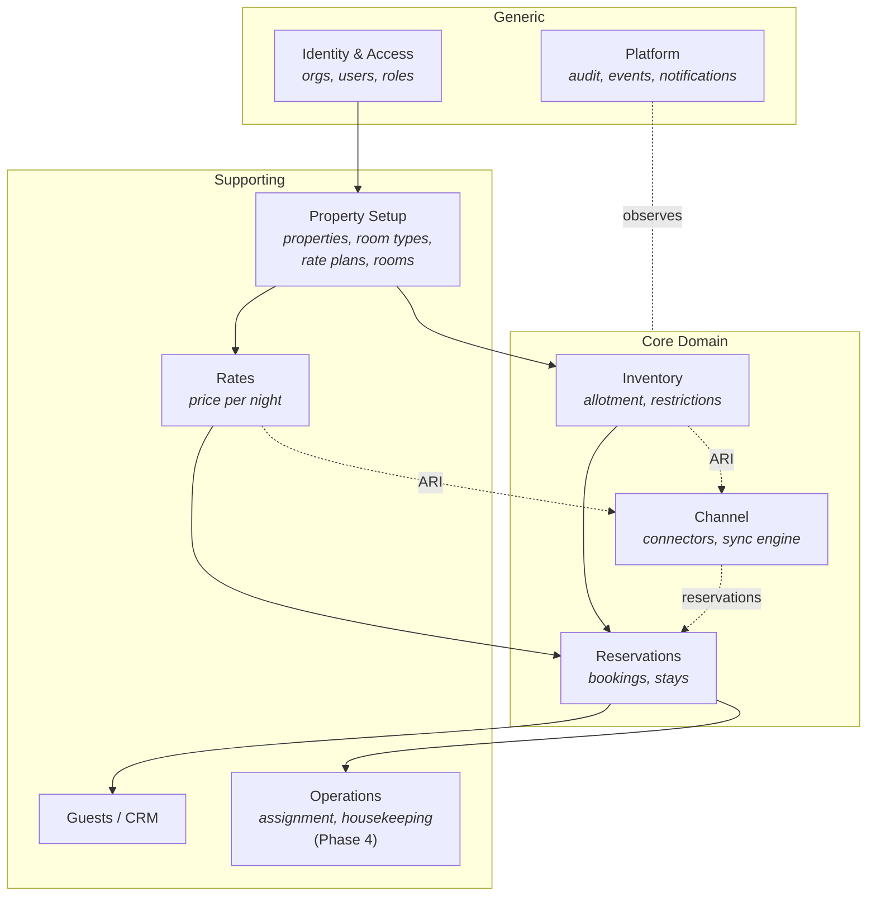
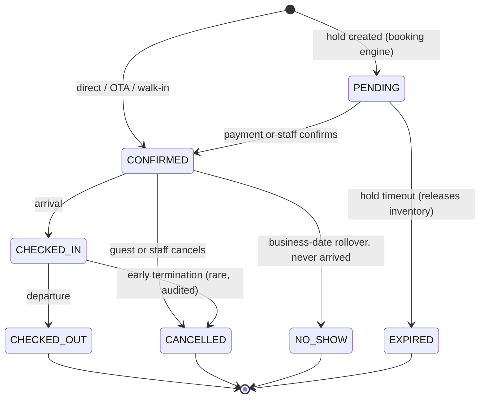

# DeeHub Hotel — Domain Model

Engineering Task 3. This is the conceptual model: bounded contexts,
aggregates, invariants, state machines, and events. Physical tables, indexes
and constraints live in [database.md](database.md); this document is what the
code's type names and module boundaries must mirror.

Constrained by [ADR-0001](adr/0001-multi-property-saas.md) (multi-tenancy),
[ADR-0002](adr/0002-count-based-inventory.md) (count-based inventory) and
[ADR-0003](adr/0003-thailand-first-i18n-ready.md) (money and dates).

---

## 1. Ubiquitous language

Use these words in code, APIs, docs and conversation. Do not invent synonyms.

| Term              | Meaning                                                                                                                                              |
| ----------------- | ---------------------------------------------------------------------------------------------------------------------------------------------------- |
| **Organization**  | The tenant. A hotel owner or group that signs up. Owns properties, users, billing.                                                                   |
| **Property**      | One hotel. Has its own timezone, currency, address, tax settings.                                                                                    |
| **Room Type**     | A sellable category ("Deluxe Double"), _not_ a physical room. The unit of inventory and rates.                                                       |
| **Physical Room** | A real room with a number ("301"). Used for assignment and housekeeping only — never for availability (ADR-0002).                                    |
| **Allotment**     | Number of sellable units of a room type on a given night.                                                                                            |
| **Booked**        | Units of allotment consumed by inventory-holding reservations on a night.                                                                            |
| **Availability**  | `allotment − booked`. Never derived from physical rooms.                                                                                             |
| **ARI**           | Availability, Rates, Inventory — the payload exchanged with OTAs.                                                                                    |
| **Restriction**   | A rule blocking a sale: stop-sell, min/max stay, CTA, CTD.                                                                                           |
| **Stop-sell**     | Room type closed for sale on a night regardless of availability.                                                                                     |
| **CTA / CTD**     | Closed to Arrival / Closed to Departure — the stay may not start / end on that night.                                                                |
| **LOS**           | Length of Stay, in nights.                                                                                                                           |
| **Rate Plan**     | A commercial offer attached to a room type (e.g. "BAR Room Only", "Non-refundable Breakfast Included"). Carries policy: cancellation, meal, payment. |
| **BAR**           | Best Available Rate — the standard parent rate plan.                                                                                                 |
| **Derived Rate**  | A rate plan priced as an offset from a parent (−10%, −200 THB). Phase 3.                                                                             |
| **Business Date** | Today's calendar date in the _property's_ timezone. The only "today" the domain knows.                                                               |
| **Night**         | A calendar date a stay occupies. A stay 12→14 Aug occupies nights 12 and 13.                                                                         |
| **Stay**          | One room-type × date-range × rate plan × occupancy line within a reservation.                                                                        |
| **Reservation**   | A booking, containing one or more stays. The aggregate customers talk about.                                                                         |
| **Guest**         | A person; the CRM record. Distinct from the booker on a reservation.                                                                                 |
| **Channel**       | A sales channel: an OTA, the direct booking engine, or walk-in/phone.                                                                                |
| **Mapping**       | The link between a DeeHub room type / rate plan and a channel's own identifiers.                                                                     |
| **Sync**          | Pushing ARI to a channel or pulling reservations from it.                                                                                            |
| **No-show**       | A confirmed guest who never arrived.                                                                                                                 |
| **Pickup**        | Reservations received in a period for future dates.                                                                                                  |
| **ADR / RevPAR**  | Average Daily Rate / Revenue Per Available Room.                                                                                                     |

---

## 2. Bounded contexts



**Core domain** is Inventory + Reservations + Channel. That is where
correctness is worth paying for and where competitors fail. Everything else
is table stakes.

**Dependency rule:** arrows point in one direction only. Inventory never
imports Reservations; Reservations tells Inventory to hold units through an
application service. Channel never imports Reservations' internals — it
receives events and calls a public port. See
[architecture.md](architecture.md) for enforcement.

---

## 3. Aggregates

An aggregate is a consistency boundary: one transaction, one aggregate,
invariants always true at commit.

### 3.1 Identity & Access

| Aggregate        | Contents                                  | Key invariants                                                                                          |
| ---------------- | ----------------------------------------- | ------------------------------------------------------------------------------------------------------- |
| **Organization** | name, slug, status, plan                  | Slug unique globally. Suspended org → all access denied.                                                |
| **User**         | email, password hash, status, MFA (later) | Email unique within organization.                                                                       |
| **Membership**   | user ↔ organization, role, property scope | A user's effective permissions = union of memberships. At least one OWNER per organization must remain. |

Roles: `OWNER`, `ADMIN`, `MANAGER` (property-scoped), `FRONT_DESK`
(property-scoped), `READ_ONLY`. Permissions are checked as capabilities
(`reservation:cancel`), not role-name string comparisons.

### 3.2 Property Setup

| Aggregate        | Contents                                                                                                                     | Key invariants                                                                                                                                                                     |
| ---------------- | ---------------------------------------------------------------------------------------------------------------------------- | ---------------------------------------------------------------------------------------------------------------------------------------------------------------------------------- |
| **Property**     | name, timezone (IANA), currency (ISO 4217), address, check-in/out times, tax & service-charge config, business-date rollover | Timezone and currency are immutable after the first reservation exists.                                                                                                            |
| **RoomType**     | code, name, description, standard/max occupancy, adult & child capacity, photos                                              | `code` unique per property. `standardOccupancy ≤ maxOccupancy`. Cannot be deleted while future inventory or reservations exist — deactivate instead.                               |
| **PhysicalRoom** | number, floor, room type, status (`CLEAN`/`DIRTY`/`INSPECTED`/`OUT_OF_ORDER`)                                                | `number` unique per property. Belongs to exactly one room type. **Count of physical rooms does not constrain allotment** (ADR-0002) — intentional, enables controlled overselling. |
| **RatePlan**     | code, name, room type, parent (nullable), meal plan, cancellation policy, payment policy, is-derived + offset                | `code` unique per property. A derived plan's parent must belong to the same room type and must not itself be derived (one level only).                                             |

### 3.3 Inventory — the critical aggregate

**Aggregate root: `InventoryDay` — one row per (property, roomType, date).**

Deliberately tiny. A large "inventory calendar" aggregate would serialize
every booking in the hotel; per-night rows let unrelated bookings proceed in
parallel while still giving a hard consistency boundary where it matters.

| Field                                  | Notes                                                                                              |
| -------------------------------------- | -------------------------------------------------------------------------------------------------- |
| `allotment`                            | Sellable units. Set by staff; may exceed physical room count (overselling is a business decision). |
| `booked`                               | Units held by reservations. **Only the Inventory module writes this.**                             |
| `stopSell`                             | Boolean, closes the night for sale.                                                                |
| `minStay`, `maxStay`                   | LOS restrictions, evaluated against the whole stay.                                                |
| `closedToArrival`, `closedToDeparture` | CTA/CTD.                                                                                           |

**Invariants**

1. `0 ≤ booked ≤ allotment` — enforced by a database CHECK constraint, not
   only by application code. This is the anti-overbooking guarantee.
2. `allotment ≥ 0`.
3. Lowering `allotment` below current `booked` is rejected; staff must move
   or cancel reservations first.
4. A missing row means "not yet loaded" and is treated as
   `allotment = 0` — a hotel that has not opened a date cannot sell it.

**Concurrency — the single most important rule in the system.** Holding
inventory for a stay is _never_ read-then-write. It is one guarded statement
per booking, inside the reservation transaction:

```sql
-- Lock in deterministic order (date ASC) to make deadlocks impossible
SELECT id FROM inventory_day
 WHERE property_id = $1 AND room_type_id = $2 AND date = ANY($3::date[])
 ORDER BY date
   FOR UPDATE;

UPDATE inventory_day
   SET booked = booked + $units
 WHERE property_id = $1 AND room_type_id = $2 AND date = ANY($3::date[])
   AND booked + $units <= allotment;
-- affected rows MUST equal array_length($3) — otherwise ROLLBACK:
-- some night was full or missing.
```

Two concurrent bookings for the last room: one commits, the other's row
count comes up short and the whole reservation rolls back. No overbooking is
possible even under OTA burst traffic. Deterministic lock ordering by date
prevents the deadlock that a naive multi-row update would hit.

**Reconciliation.** A nightly job recomputes `booked` from
inventory-holding reservations and alerts on any drift. Drift means a bug;
the job is a safety net and an alarm, not a normal repair path.

### 3.4 Rates

**Aggregate root: `RateDay` — one row per (property, ratePlan, date, occupancy).**

Occupancy-based pricing (single/double/triple) is standard in Thai hotels and
required by OTAs. Price is a `Money` value object (integer minor units +
currency, ADR-0003). Derived rate plans compute from the parent at read time;
what is _sold_ is always snapshotted (§3.5).

### 3.5 Reservations

**Aggregate root: `Reservation`.** Contains `Stay` entities, which contain
`StayNight` entities.

```
Reservation (root)
├─ code, channel, status, booker contact, source metadata
├─ totalAmount (Money), currency, tax/fee breakdown
├─ Stay[]                       one per room-type × date-range × rate plan
│   ├─ roomType, ratePlan, checkIn, checkOut, adults, children
│   ├─ assignedPhysicalRoom?    (Phase 4, nullable, front-desk only)
│   └─ StayNight[]              one per night: date, price (Money), meals
└─ guestId?                     link to CRM Guest
```

**One stay = one room unit.** A guest booking two Deluxe rooms produces two
`Stay` entities, not one stay with a quantity. Each can be assigned to a
different physical room and carry different occupancy, and inventory
counting stays trivial: units held on a night = number of stay-nights.

**Why nights are materialized:** OTAs send per-night prices, revenue reports
need per-night revenue, partial-stay modifications change individual nights,
and the price must be frozen at booking time. Recomputing from a rate plan
later would silently rewrite history when rates change.

**Invariants**

1. `checkOut > checkIn`; a stay occupies nights `[checkIn, checkOut)`.
2. `StayNight` rows exactly cover those dates — no gaps, no duplicates.
3. `totalAmount` = Σ night prices + taxes/fees, all in the property currency.
4. Prices are **snapshots**. Changing a rate plan never alters an existing
   reservation.
5. `adults + children ≤ roomType.maxOccupancy`.
6. Every status change is recorded in the audit log with actor and reason.
7. A reservation belongs to exactly one property. Multi-property bookings are
   separate reservations.

**Inventory-holding states.** These states hold inventory:
`PENDING`, `CONFIRMED`, `CHECKED_IN`, `CHECKED_OUT`.
These do not: `CANCELLED`, `NO_SHOW`.

On transition to a non-holding state, release only nights **not yet
consumed** (night date ≥ business date). Consumed nights stay counted so
occupancy history and revenue reports remain truthful — a guest who no-showed
still occupied that allotment for the night it was held.
_Business rule to confirm with the founder._

`PENDING` exists for booking-engine holds and expires (default 15 minutes)
via a scheduled job that releases inventory. Unbounded pending holds are an
availability-denial vector.

### 3.6 Reservation state machine



Transitions not drawn are rejected by the domain, not merely by the UI.
Modification (dates, room type, occupancy) is a separate operation available
in `PENDING`/`CONFIRMED`/`CHECKED_IN` and is modeled as _release old nights +
hold new nights in one transaction_ — never as a delete-then-create.

### 3.7 Guests

| Aggregate | Contents                                                                         | Key invariants                                                                                                                                                |
| --------- | -------------------------------------------------------------------------------- | ------------------------------------------------------------------------------------------------------------------------------------------------------------- |
| **Guest** | name, email, phone, nationality, document (encrypted), preferences, stay history | Scoped to organization (shared across that org's properties). Duplicates are expected from OTAs; dedupe/merge is Phase 4 and must preserve reservation links. |

OTAs frequently supply masked or aliased guest email addresses. A reservation
therefore stores the raw booker contact it received _and_ optionally links to
a Guest; the link is an enrichment, never a requirement.

### 3.8 Channel

| Aggregate              | Contents                                                                                                             | Key invariants                                                                                                                                                                |
| ---------------------- | -------------------------------------------------------------------------------------------------------------------- | ----------------------------------------------------------------------------------------------------------------------------------------------------------------------------- |
| **Channel**            | property, type (`AGODA`/`BOOKING_COM`/`MOCK_OTA`/`DIRECT`/`WALK_IN`), credentials (encrypted), status, sync settings | One active channel per (property, type).                                                                                                                                      |
| **ChannelMapping**     | channel, DeeHub room type + rate plan ↔ channel's own IDs                                                            | A mapping must exist before ARI is pushed or a reservation is ingested. Unmapped inbound reservations go to an error queue for staff resolution — **never silently dropped**. |
| **SyncJob**            | channel, kind (`ARI_PUSH`/`RESERVATION_PULL`), date range, status, attempts, last error                              | Idempotent and retryable. Terminal failure raises an alert.                                                                                                                   |
| **ChannelReservation** | raw inbound payload, channel reference, dedupe key, mapped reservation ID, status                                    | Dedupe key `(channel, channelReservationId)` is unique — OTAs redeliver, and double-booking from redelivery is unacceptable.                                                  |

**Sync conflict rule (non-negotiable):** when DeeHub state and channel state
disagree, resolve toward _never oversell_. Push the lower availability; if an
OTA delivers a booking for inventory we no longer have, accept the
reservation (the guest is real and holds a confirmation) and raise an
**overbooking alert** for staff. Refusing a real booking silently is worse
than surfacing it loudly.

### 3.9 Platform

| Aggregate        | Contents                                                                 | Notes                                                               |
| ---------------- | ------------------------------------------------------------------------ | ------------------------------------------------------------------- |
| **AuditLog**     | actor, action, entity type/ID, before/after, IP, timestamp, org/property | Append-only. Required by Definition of Done for every state change. |
| **OutboxEvent**  | event type, payload, aggregate ref, published-at                         | Transactional outbox (see §5).                                      |
| **Notification** | channel (email/LINE), template, recipient, status                        | Phase 4.                                                            |

---

## 4. Domain events

Named `<context>.<aggregate>.<past-tense-verb>`. Every event carries
`organizationId`, `propertyId`, `occurredAt` (UTC), `actor`, and a version.

| Event                          | Emitted when                                 | Primary consumers                            |
| ------------------------------ | -------------------------------------------- | -------------------------------------------- |
| `reservation.created`          | Booking confirmed from any channel           | Channel (ARI push), Notifications, Analytics |
| `reservation.modified`         | Dates/room/occupancy/price changed           | Channel, Notifications                       |
| `reservation.cancelled`        | Cancelled                                    | Channel, Notifications                       |
| `reservation.status_changed`   | Any other transition (check-in, no-show…)    | Analytics, Operations                        |
| `inventory.changed`            | Allotment, restrictions, or `booked` changed | **Channel (ARI push)**                       |
| `rate.changed`                 | Rate plan price changed for dates            | **Channel (ARI push)**                       |
| `channel.reservation_received` | Inbound OTA booking ingested                 | Reservations                                 |
| `channel.sync_failed`          | Sync job exhausted retries                   | Notifications, on-call alerting              |
| `channel.overbooking_detected` | Inbound booking exceeds availability         | Notifications (urgent), Operations           |

`inventory.changed` is the highest-volume event and the heart of the channel
manager: every allotment edit and every booking must reach the OTAs within
60 seconds (Milestone 1 target).

---

## 5. Cross-cutting rules

**Transactional outbox.** Events are written to `outbox_event` in the _same
database transaction_ as the state change, then relayed to BullMQ by a
publisher. Enqueueing directly from a service is forbidden: a crash between
commit and enqueue would leave OTAs permanently stale (silent overbooking
risk), and an enqueue before a rollback would push phantom availability.

**Idempotency.** Every inbound integration point (OTA reservation delivery,
booking-engine submit, retried sync job) carries an idempotency key and is
safe to process twice. Retries are certain; duplicates must be impossible.

**Tenancy.** Every aggregate except `Organization` and `User` carries
`organizationId`. Repositories require a tenant context; there is no
unscoped read path. Cross-tenant leakage is the top security risk of
ADR-0001 and gets an explicit test per feature.

**Money.** `Money = { amount: integer minor units, currency: ISO 4217 }`.
No floats anywhere, no bare numbers in money fields, no cross-currency
arithmetic in v1.

**Dates.** Nights are `DATE` in property timezone. Event/audit timestamps are
UTC `timestamptz`. Never derive a business date from `new Date()` on the
server — always from the property's timezone.

---

## 6. Open questions

1. **Late cancellation of consumed nights** (§3.5) — **implemented** as
   written: cancelling releases only nights on or after the property's current
   business date, and already-consumed nights stay counted so occupancy history
   stays truthful. Covered by
   `create-reservation.integration.test.ts` ("retains nights already consumed
   when cancelled mid-stay"). Still worth a founder sign-off, since it changes
   occupancy and ADR reporting; reversing it is a one-line change plus a test.
2. **Group bookings / room blocks** — out of scope for Milestone 1; would
   likely become a `Block` aggregate reserving allotment without guests.
3. **Multi-property reservations** — currently disallowed; revisit if chains
   ask for it.
4. **Channel-level allotment splitting** (giving Agoda 5 of 10 rooms) —
   deliberately excluded. Pooled inventory sells more; revisit only if a
   contract requires it.
5. **Payments** — not modeled until Phase 3 (see roadmap); will introduce
   `Folio`/`Payment` aggregates and must not entangle Reservations' state
   machine.
